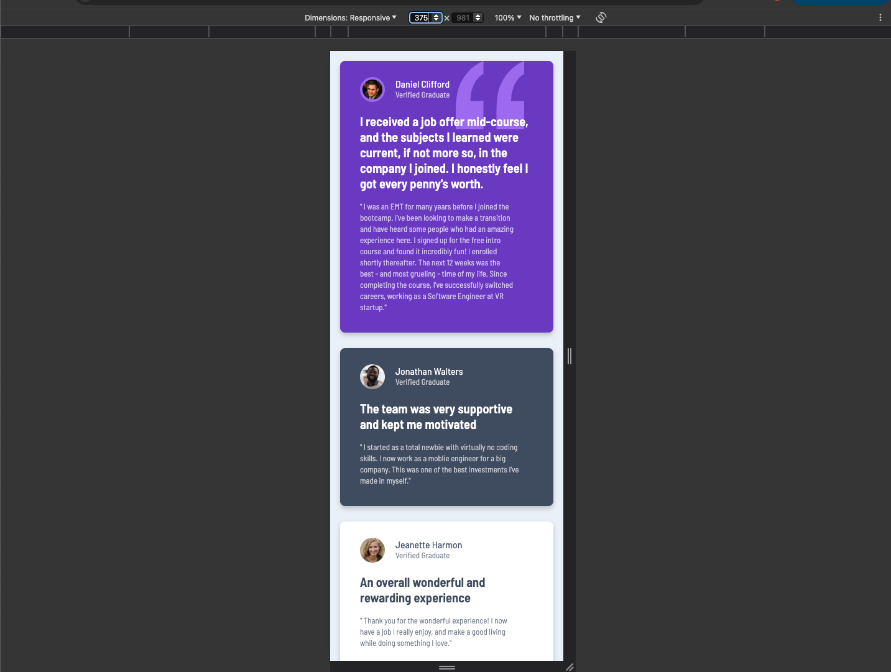

# Frontend Mentor - Testimonials grid section solution

This is a solution to the [Testimonials grid section challenge on Frontend Mentor](https://www.frontendmentor.io/challenges/testimonials-grid-section-Nnw6J7Un7). Frontend Mentor challenges help you improve your coding skills by building realistic projects.

## Table of contents

- [Overview](#overview)
  - [The challenge](#the-challenge)
  - [Screenshot](#screenshot)
  - [Links](#links)
- [My process](#my-process)
  - [Built with](#built-with)
  - [What I learned](#what-i-learned)
  - [Continued development](#continued-development)
  - [Useful resources](#useful-resources)
- [Author](#author)

## Overview

### The challenge

### Screenshot




### Links

- Solution URL: [Solution URL here](https://github.com/hectorlil48/testimonials-grid-section-)
- Live Site URL: [Live site URL here](https://hectorlil48.github.io/testimonials-grid-section-/)

## My process

### Built with

- Semantic HTML5 markup
- CSS custom properties
- Flexbox
- CSS Grid
- Mobile-first workflow

### What I learned

I had more practice using the display grid. And I’m getting the hang of it. I also got to use my first CSS animation. I set up classes to be able to fade up and fade down, then applied to change with the breakpoints.

```css
@keyframes fadeInUp {
  from {
    opacity: 0;
    transform: translateY(20px);
  }
  to {
    opacity: 1;
    transform: translateY(0);
  }
}

@keyframes fadeInDown {
  from {
    opacity: 0;
    transform: translateY(-20px);
  }
  to {
    opacity: 1;
    transform: translateY(0);
  }
}
```

### Continued development

I will continue to use the display grid to make my layouts more responsive. I will get more practice using CSS animations. And how I can include them in my future projects. I will get better at writing CSS code.

### Useful resources

- [MDN](https://developer.mozilla.org/en-US/) - MDN is always useful. I was able to get a refresher of the display grid. I learned how to set up my columns and rows. I also learned how to make a fade in and fade out animation, using keyframes.
- [stackoverflow](https://stackoverflow.co/) - Stackoverflow is always helpful. I looked up some display grid examples.

## Author

- GitHub - [Hector Ramirez](https://github.com/hectorlil48)
- Frontend Mentor - [@hectorlil48](https://www.frontendmentor.io/profile/hectorlil48)
- LinkedIn - [@linkedin.com/in/hector-ramirez-6a6509170](https://www.linkedin.com/in/hector-ramirez-6a6509170/overlay/contact-info/)
